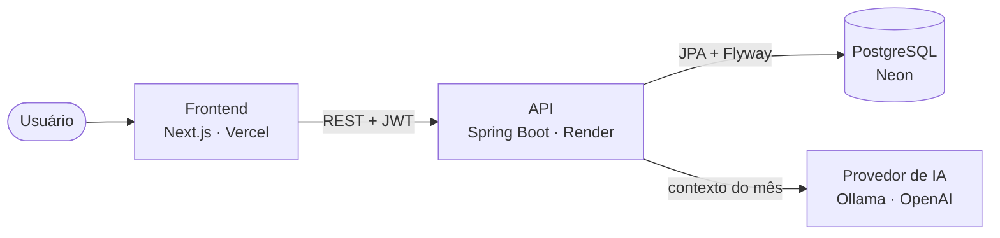

<div align="center">

# Zenith

**Finanças compartilhadas para duas pessoas.** Lançamentos, um dashboard que fecha o mês, a divisão justa entre o casal e um assistente que lê os números e aponta onde vale ajustar.

[**Demo ao vivo**](https://zenith-web-chi.vercel.app) · [Documentação da API (Swagger)](https://zenith-backend-h42r.onrender.com/swagger-ui.html)

</div>

> Entre na demo com **bruno.demo@zenith.app** / **Zenith#Demo2026**.
> A conta já vem com três meses de lançamentos de um casal e o assistente habilitado.

<p align="center">
  
</p>

## Por que existe

Dividir contas a dois quase sempre termina em planilha bagunçada ou num "depois a gente acerta". Zenith parte de uma ideia simples: uma fatura, dois donos, tudo à vista — quem lançou o quê, quanto cada um contribuiu e para onde o dinheiro foi no mês. Nasceu pensando em casais, mas serve para qualquer dupla que rateia despesas.

## O que dá pra fazer

- **Fatura compartilhada entre duas pessoas** — convite por e-mail, aceite, e as duas passam a ver os mesmos números.
- **Lançamentos** com categorias, filtros por período, pessoa e tipo, e exportação em Excel.
- **Dashboard do mês** — entradas, saídas, saldo, taxa de poupança, ritmo de gasto e projeção de fechamento.
- **Divisão do casal** — quanto cada um entrou e gastou, em valor e em proporção.
- **Assistente com IA** — escolha o mês, pergunte em linguagem natural e receba uma leitura do que pesou e do que dá para cortar. Com cota diária e limite por minuto à mostra.
- **Autenticação de verdade** — JWT com refresh em cookie httpOnly, rotação de token e recuperação de senha.

## Stack

**Backend** — Java 21, Spring Boot 3.5, Spring Security, JPA/Hibernate, PostgreSQL com Flyway. JWT (jjwt), exportação XLSX (Apache POI) e documentação viva com springdoc/OpenAPI.

**Frontend** — Next.js 16, React 19, TypeScript e Tailwind CSS 4. TanStack Query para dados do servidor, Zustand para estado de sessão, React Hook Form + Zod nos formulários.

**Infra** — backend no Render (Docker), banco no Neon, frontend na Vercel, CI no GitHub Actions.

## Arquitetura



O frontend nunca fala com o banco nem com o provedor de IA direto — tudo passa pela API autenticada. O token de acesso dura 15 minutos e o refresh vive num cookie httpOnly; a rotação derruba a sessão inteira se um refresh já usado reaparece. A camada de IA fica atrás de uma interface, então o mesmo código roda com um modelo local em desenvolvimento e com a OpenAI em produção. Se o provedor cai, o assistente devolve um resumo seguro em vez de quebrar.

## Decisões que valem comentar

- **IA plugável e barata de rodar.** `AiProvider` tem três implementações: desligada, Ollama local e OpenAI. Em produção o acesso é liberado por conta, com limite por minuto e cota diária — uma conta nova não gasta a chave da OpenAI.
- **Refresh token com detecção de reuso.** Cada renovação gera um par novo e revoga o anterior. Se um token revogado volta, todas as sessões daquele usuário são invalidadas.
- **E-mail opcional.** `EmailService` tem duas implementações: SMTP real quando configurado, e uma que registra o link em log quando não há servidor. O app sobe e funciona sem depender de e-mail.
- **Autorização checada em cada operação.** Todo endpoint de fatura confirma que o usuário é membro, e recurso aninhado é buscado por `id + fatura` — não dá para ler a transação de outra fatura trocando o id na URL.
- **Health desacoplado do e-mail** para o deploy não falhar por causa de SMTP ausente.

## Assistente com IA

<p align="center">
  
</p>

A pergunta parte sempre do mês selecionado, e quando há histórico suficiente o assistente compara com os meses anteriores. Toda chamada passa pelo backend: o prompt carrega guardrails contra injeção, o uso respeita cota e rate limit, e o front nunca vê a chave do provedor.

## Rodando localmente

Pré-requisitos: Java 21, Node 20+ e Docker.

Banco:

```bash
docker compose up -d
```

Backend — copie `backend/.env.example` para `backend/.env` e rode:

```bash
cd backend
./mvnw spring-boot:run
```

Frontend — crie `frontend/.env` com `API_URL` e `SITE_URL` e rode:

```bash
cd frontend
npm install
npm run dev
```

App em `http://localhost:3000`, API em `http://localhost:8080`, documentação em `http://localhost:8080/swagger-ui.html`.

## Qualidade

- `./mvnw verify` roda os testes (unitários, de repositório com H2 e de controller com MockMvc) e gera o relatório de cobertura (JaCoCo).
- No frontend, `npm run lint`, `npm run typecheck` e `npm run build`.
- O GitHub Actions roda tudo isso a cada push e pull request.

## Autor

Gustavo Gaiotti — [github.com/GusGaiotti](https://github.com/GusGaiotti)
